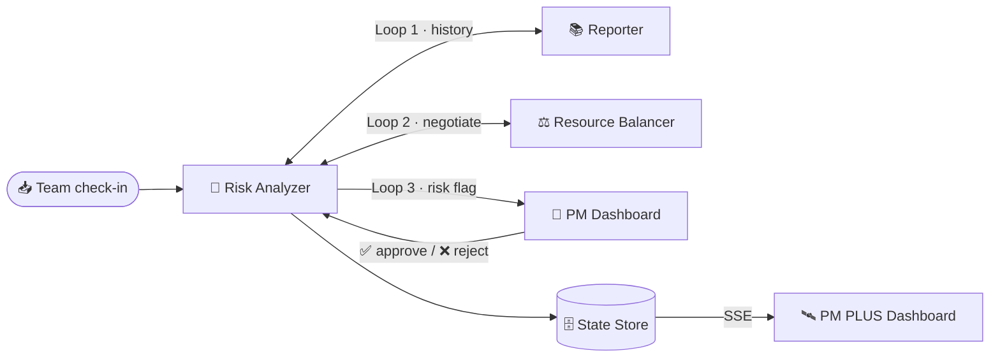

<div align="center">

# 🛰️ PM PLUS

### Autonomous Multi-Agent Project Intelligence

*An agent workforce that chases status updates, negotiates fixes, and surfaces risks — **before** a human PM ever opens the dashboard.*

[](https://lablab.ai/ai-hackathons/band-of-agents-hackathon)
[](https://band.ai)
[](https://www.python.org/)
[](https://expressjs.com/)
[](https://vitejs.dev/)
[](./LICENSE)

</div>

---

> 🏆 **Built for the [Band of Agents Hackathon](https://lablab.ai/ai-hackathons/band-of-agents-hackathon)** (lablab.ai · Jun 12–19, 2026) — a challenge to build enterprise-ready multi-agent systems where **3+ specialized agents collaborate** over **[Band](https://band.ai)**, the universal interaction layer for AI agents.

## 🎯 The Problem

Enterprise PMs spend most of their time **chasing status updates and reallocating resources** — not managing strategy. Systemic risks like persistent bottlenecks are spotted too late to prevent slippage.

## 💡 The Solution

PM PLUS replaces passive dashboards with an **autonomous agent workforce**. Specialized agents negotiate with each other over Band, query shared history, and proactively manage project health — escalating to a human only for high-stakes decisions.

---

## 🤖 The Agent Mesh

Three specialized agents collaborate through **Band rooms** via `@mention` + structured JSON messages — genuine bidirectional handshakes, not a serial chain.

| Agent | Role | What it does |
|-------|------|--------------|
| 🧠 **Risk Analyzer** | *The brain* | Consumes check-ins, scores severity against history, negotiates fixes, escalates to the PM |
| 📚 **Reporter** | *The memory* | RAG-style history queries, archives every event, generates weekly summaries |
| ⚖️ **Resource Balancer** | *The optimizer* | Manages team capacity, proposes reassignments when someone is overloaded |

### Closed-Loop Execution



| # | Loop | Flow |
|---|------|------|
| **1** | History | Risk Analyzer ↔ Reporter — *"Has this blocker persisted?"* shapes the severity score |
| **2** | Negotiation | Risk Analyzer ↔ Resource Balancer — delegates an overload, gets a reassignment proposal |
| **3** | Human-in-the-Loop | Risk Analyzer → PM → back to the agent — flag awaits explicit **Approve / Reject** |

---

## 🏗️ Architecture

```
PM-PLUS/
├── src/          # 🐍 Role 1 — Python agents (Risk Analyzer · Reporter · Resource Balancer)
├── api/          # 🟦 Role 2 — TypeScript orchestration API + SSE + Swagger
└── dashboard/    # ⚛️ Role 3 — React/Vite observability dashboard ("PM PLUS")
```

| Layer | Stack | Responsibility |
|-------|-------|----------------|
| **Agents** | Python · Band SDK · GPT-4o | The negotiating workforce |
| **Orchestrator** | TypeScript · Express | State store, Band proxy, HITL bridge, real-time SSE |
| **Dashboard** | React · Vite · Tailwind | Live observability + PM approval cockpit |

---

## 🚀 Quick Start

> **Zero keys needed for the demo.** The dashboard ships with an offline simulation that streams the full 3-loop negotiation — no Band/LLM credentials required.

**1 — Backend (orchestration API)**
```bash
npm install
npm run dev          # ➜ http://localhost:3000   (Swagger at /api-docs)
```

**2 — Dashboard (PM PLUS)**
```bash
cd dashboard
npm install
npm run dev          # ➜ http://localhost:5173
```

**3 — Run the demo** → open **http://localhost:5173**, wait for the status dot to go 🟢 **Connected**, then click **▶ Run Simulated Demo**. Watch the negotiation loop stream in live, risk climb to **HIGH**, and a flag land in the **HITL Decision Panel** — approve it with a note.

<details>
<summary><b>Optional — run the real agent pipeline</b></summary>

Requires Band/LLM keys (see [Configuration](#-configuration)).
```bash
python3 -m venv .venv && source .venv/bin/activate
pip install -r requirements.txt
python src/main.py                       # starts all 3 Band agents
```
Then click **⚡ Trigger Real Pipeline** in the dashboard, or run `python src/mock_collector.py`.
</details>

---

## 🛰️ The Dashboard

The observability cockpit ("PM PLUS") proves the negotiation loop in real time:

- **Live Event Stream** — SSE-connected message log, color-coded by agent and tagged by loop
- **HITL Decision Panel** — Approve / Reject + PM notes, bridged back to the waiting agent
- **Agent Status View** — active / waiting / negotiating health per agent
- **Project Context** — live risk level and project metrics
- **Mock Data Generator** — offline simulation **and** real-pipeline trigger

---

## 🔌 Key API Endpoints

| Method | Path | Description |
|--------|------|-------------|
| `GET`  | `/updates?sessionId=xxx` | **SSE** real-time event stream |
| `POST` | `/human/approval-request` | Create a PM approval request |
| `POST` | `/human/approval-response` | Approve/reject → bridges decision back to Band |
| `POST` | `/demo/session` | Create a dashboard session |
| `POST` | `/demo/simulate` | Run the **offline** scripted Loop 1/2/3 demo |
| `POST` | `/demo/trigger-real` | Drive the **real** Band agent pipeline |
| `GET`  | `/state?sessionId=xxx` | Session state snapshot |
| `GET`  | `/agent/me` | Band.ai agent profile proxy |

Full interactive reference: **Swagger UI at `http://localhost:3000/api-docs`**.

---

## ⚙️ Configuration

The offline demo needs **no configuration**. For the real Band pipeline, copy the template and fill in your keys:

```bash
cp .env.example .env
```

`.env.example` documents every variable — Band rooms, the three agent identities, and the LLM provider. See [`.env.example`](./.env.example) for the full, commented list.

---

## ✅ Hackathon Requirements

| Requirement | Status |
|-------------|:------:|
| 3+ specialized agents collaborating through Band | ✅ Risk Analyzer · Reporter · Resource Balancer |
| Band as the active layer (context, handoffs, state) | ✅ All 3 loops use genuine Band messaging |
| Back-and-forth communication (not serial) | ✅ Futures + async reply pattern |
| Agents delegate / hand off tasks | ✅ Loop 2 — Risk delegates to Balancer on overload |
| Human-in-the-loop | ✅ Loop 3 — flag → PM → bridged back to the agent |
| Observability | ✅ Live PM PLUS dashboard |

---

## 🧰 Tech Stack

**Agents:** Python · [Band SDK](https://band.ai) · GPT-4o (aimlapi, featherless fallback) · Pydantic
**Orchestrator:** TypeScript · Express · Server-Sent Events · Swagger
**Dashboard:** React 18 · Vite · Tailwind CSS · EventSource

---

## 📄 License

[MIT](./LICENSE) · Built with 🎵 on [Band](https://band.ai) for the [Band of Agents Hackathon](https://lablab.ai/ai-hackathons/band-of-agents-hackathon).
